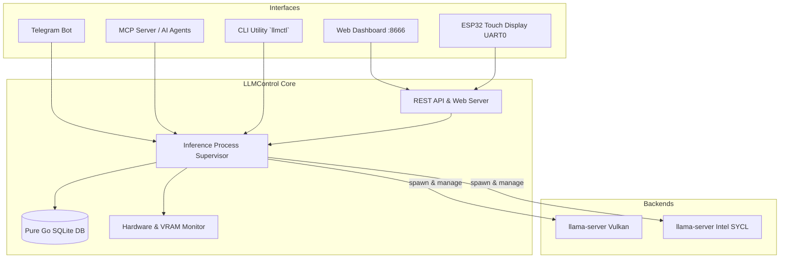

# LLM Control Center (`llmcontrol`)

[English](README.md) | [Русский](README.ru.md)

[](https://go.dev/)
[](https://opensource.org/licenses/MIT)
[-003B57?style=flat&logo=sqlite)](https://modernc.org/sqlite)

⚡ **LLM Control Center** — lightweight (~10–15 MB RAM), high-performance process supervisor, web dashboard, and CLI tool written in Go for managing local LLM inference engines (Vulkan / Intel SYCL / CPU `llama-server`).

Provides a unified control hub across multiple interfaces:
- 🌐 **Embedded Web UI**: Single-page dark cyberpunk dashboard on `http://localhost:8666` (zero npm / node dependencies).
- 📱 **Telegram Bot**: Resilient inline menu, real-time status reporting, and admin-authenticated remote controls.
- 🤖 **Model Context Protocol (MCP) Server**: Native stdio MCP server for agentic AI IDEs (Claude Desktop, Cursor, Antigravity).
- 📟 **ESP32 Touch Display Bridge**: Real-time telemetry, model switcher, and profile selector for desk displays (e.g. ESP32-4848S040).
- 📊 **Resource & Hardware Telemetry**: Real-time VRAM (Intel Arc A770, etc.), RAM, CPU, GPU temperature, and token speed (TPS).
- 💾 **Pure Go SQLite Storage**: Zero CGO dependencies, self-contained binary.

---

## 🏗️ Architecture Overview



---

## 🚀 Quick Start

### 1. Build from Source
```bash
git clone https://github.com/antifreezzz/llmcontrol.git
cd llmcontrol
make build
# or: go build -o llmctl ./cmd/llmctl
```

### 2. Configuration
Copy the example config:
```bash
cp config.example.json config.json
```
Edit `config.json`:
```json
{
  "http_host": "0.0.0.0",
  "http_port": 8666,
  "db_path": "~/.llmcontrol/llmcontrol.db",
  "log_dir": "~/.llmcontrol/logs",
  "exclusive_mode": true,
  "telegram_token": "YOUR_TELEGRAM_BOT_TOKEN",
  "telegram_admin_id": 123456789
}
```

### 3. Import Existing Shell Scripts (Optional)
If you already have shell scripts launching models:
```bash
./llmctl import ~/bin
```

### 4. CLI Usage
```bash
# List all configured models and their status
./llmctl list

# Start a model with a profile (e.g., fast, long, max)
./llmctl start gemma4 --profile fast

# Benchmark token generation speed (tok/s)
./llmctl bench gemma4

# View model runtime logs
./llmctl logs gemma4 -n 50

# Stop models
./llmctl stop gemma4
./llmctl stop --all
```

### 5. Running the Background Daemon
```bash
./llmctl daemon -config config.json
```
Open **`http://localhost:8666`** in your browser.

---

## ⚙️ Systemd Service (Autostart on Boot)

To run `llmcontrol` as a persistent background user service:
```bash
make install-service
systemctl --user enable --now llmcontrol
```

Check status or logs:
```bash
systemctl --user status llmcontrol
journalctl --user -u llmcontrol -f
```

---

## 🌐 REST API Reference

| Method | Endpoint | Description |
|---|---|---|
| `GET` | `/api/status` | Current active model, TPS, VRAM, RAM, CPU usage |
| `GET` | `/api/models` | List all models, profiles, and runtime status |
| `POST` | `/api/models` | Create a new model configuration |
| `PUT` | `/api/models/:id` | Update model properties and profiles |
| `DELETE` | `/api/models/:id` | Delete a model |
| `POST` | `/api/models/:id/start` | Start model (`{"profile":"fast"}`) |
| `POST` | `/api/models/:id/stop` | Stop specific model |
| `POST` | `/api/models/stop-all` | Stop all active inference processes |
| `POST` | `/api/models/:id/benchmark` | Run automated token speed test |
| `POST` | `/api/models/:id/profiles` | Create or update an inference profile |
| `DELETE` | `/api/models/:id/profiles/:name` | Delete a profile |

---

## 🤖 Model Context Protocol (MCP)

Add `llmcontrol` as an MCP tool provider to Claude Desktop or Cursor:

```json
{
  "mcpServers": {
    "llmcontrol": {
      "command": "/absolute/path/to/llmctl",
      "args": ["mcp"]
    }
  }
}
```

Available MCP Tools:
- `list_models`: Returns all configured models and their status.
- `start_model`: Starts a model with an optional profile name.
- `stop_all_models`: Immediately terminates running inference servers.
- `get_system_status`: Inspects active model, TPS, and VRAM / RAM metrics.
- `benchmark_model`: Runs a benchmark evaluation.

---

## 📜 License

MIT License. See [LICENSE](LICENSE) for details.

