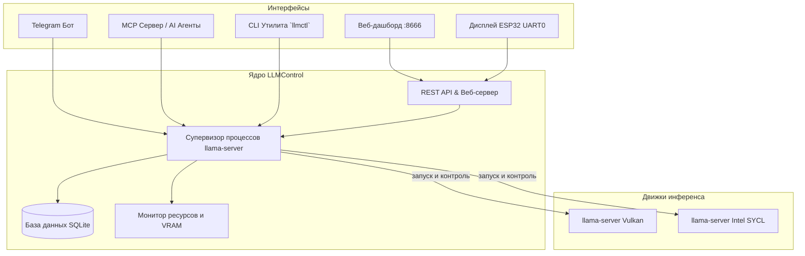

# LLM Control Center (`llmcontrol`)

[English](README.md) | [Русский](README.ru.md)

[](https://go.dev/)
[](https://opensource.org/licenses/MIT)
[-003B57?style=flat&logo=sqlite)](https://modernc.org/sqlite)

⚡ **LLM Control Center** — легковесный (~10–15 MB RAM), высокопроизводительный менеджер процессов инференса, веб-дашборд и CLI-утилита на Go для управления локальными LLM (Vulkan / Intel SYCL / CPU `llama-server`).

Объединяет управление моделями и ресурсами через несколько удобных интерфейсов:
- 🌐 **Встроенный Web UI**: Dark-дашборд на `http://localhost:8666` (без Node.js / npm / внешних зависимостей).
- 📱 **Telegram-бот**: Интерактивное inline-меню, статус инференса в реальном времени, безопасный доступ для администратора.
- 🤖 **MCP Сервер (Model Context Protocol)**: Нативный stdio MCP-сервер для AI-ассистентов (Claude Desktop, Cursor, Antigravity).
- 📟 **Мост для настольных дисплеев ESP32**: Передача телеметрии и управление моделями/профилями с тачскрина (например, ESP32-4848S040).
- 📊 **Мониторинг ресурсов**: Телеметрия VRAM (Intel Arc A770 и др.), RAM, CPU, температуры GPU и скорости генерации токенов (TPS).
- 💾 **Чистый Go SQLite**: Работает без CGO, всё упаковано в один бинарный файл.

---

## 🏗️ Архитектура системы



---

## 🚀 Быстрый старт

### 1. Сборка из исходников
```bash
git clone https://github.com/antifreezzz/llmcontrol.git
cd llmcontrol
make build
# или: go build -o llmctl ./cmd/llmctl
```

### 2. Конфигурация
Скопируйте пример конфига:
```bash
cp config.example.json config.json
```
Отредактируйте `config.json`:
```json
{
  "http_host": "0.0.0.0",
  "http_port": 8666,
  "db_path": "~/.llmcontrol/llmcontrol.db",
  "log_dir": "~/.llmcontrol/logs",
  "exclusive_mode": true,
  "telegram_token": "ВАШ_ТОКЕН_TELEGRAM_БОТА",
  "telegram_admin_id": 123456789
}
```

### 3. Импорт существующих bash-скриптов (опционально)
Если у вас уже есть shell-скрипты для запуска моделей:
```bash
./llmctl import ~/bin
```

### 4. Использование CLI
```bash
# Список всех сконфигурированных моделей и их статус
./llmctl list

# Запуск модели с нужным профилем (fast, long, max и т.д.)
./llmctl start gemma4 --profile fast

# Бенчмарк скорости генерации токенов (tok/s)
./llmctl bench gemma4

# Просмотр логов инференса
./llmctl logs gemma4 -n 50

# Остановка моделей
./llmctl stop gemma4
./llmctl stop --all
```

### 5. Запуск фонового демона
```bash
./llmctl daemon -config config.json
```
Откройте **`http://localhost:8666`** в браузере.

---

## ⚙️ Автозапуск через Systemd

Для запуска `llmcontrol` в качестве постоянной фоновой службы:
```bash
make install-service
systemctl --user enable --now llmcontrol
```

Проверка статуса и просмотр логов:
```bash
systemctl --user status llmcontrol
journalctl --user -u llmcontrol -f
```

---

## 🌐 Справочник REST API

| Метод | Эндпоинт | Описание |
|---|---|---|
| `GET` | `/api/status` | Текущая активная модель, TPS, использование VRAM, RAM, CPU |
| `GET` | `/api/models` | Список моделей, профилей инференса и их статус |
| `POST` | `/api/models` | Создание новой конфигурации модели |
| `GET` | `/api/models/:id` | Детальная информация по конкретной модели |
| `PUT` | `/api/models/:id` | Обновление параметров и профилей модели |
| `DELETE` | `/api/models/:id` | Удаление модели |
| `POST` | `/api/models/:id/start` | Запуск модели (`{"profile":"fast"}`) |
| `POST` | `/api/models/:id/stop` | Остановка конкретной модели |
| `POST` | `/api/models/stop-all` | Мгновенная остановка всех процессов инференса |
| `POST` | `/api/models/:id/bench` | Запуск автоматического замера скорости токенов |
| `POST` | `/api/models/:id/profiles` | Создание или обновление профиля инференса |
| `DELETE` | `/api/models/:id/profiles/:name` | Удаление профиля инференса |
| `POST` | `/api/models/:id/favorite` | Переключение статуса «избранное» |
| `GET` | `/api/models/:id/logs?lines=N` | Последние строки лога модели |
| `GET` | `/api/events` | Server-Sent Events (SSE) поток событий |

---

## 🤖 Интеграция по Model Context Protocol (MCP)

Добавьте `llmcontrol` как MCP-инструмент в Claude Desktop или Cursor:

```json
{
  "mcpServers": {
    "llmcontrol": {
      "command": "/абсолютный/путь/к/llmctl",
      "args": ["mcp"]
    }
  }
}
```

Доступные MCP-инструменты:
- `llm_list_models`: Возвращает список сконфигурированных моделей и их статус.
- `llm_get_status`: Возвращает активную модель, TPS, метрики VRAM / RAM / CPU.
- `llm_start_model`: Запускает модель с указанным профилем.
- `llm_stop_model`: Остановка конкретной модели по ID.
- `llm_stop_all`: Мгновенно завершает все процессы инференса.
- `llm_benchmark`: Запускает замер производительности модели.
- `llm_get_logs`: Получение последних строк лога модели.
- `llm_save_model`: Создание или обновление конфигурации модели.
- `llm_delete_model`: Удаление конфигурации модели по ID.
- `llm_save_profile`: Создание или обновление профиля инференса.
- `llm_delete_profile`: Удаление профиля модели.
- `llm_set_favorite`: Добавление модели в избранное или удаление из него.

---

## 📜 Лицензия

MIT License. Подробности в файле [LICENSE](LICENSE).
